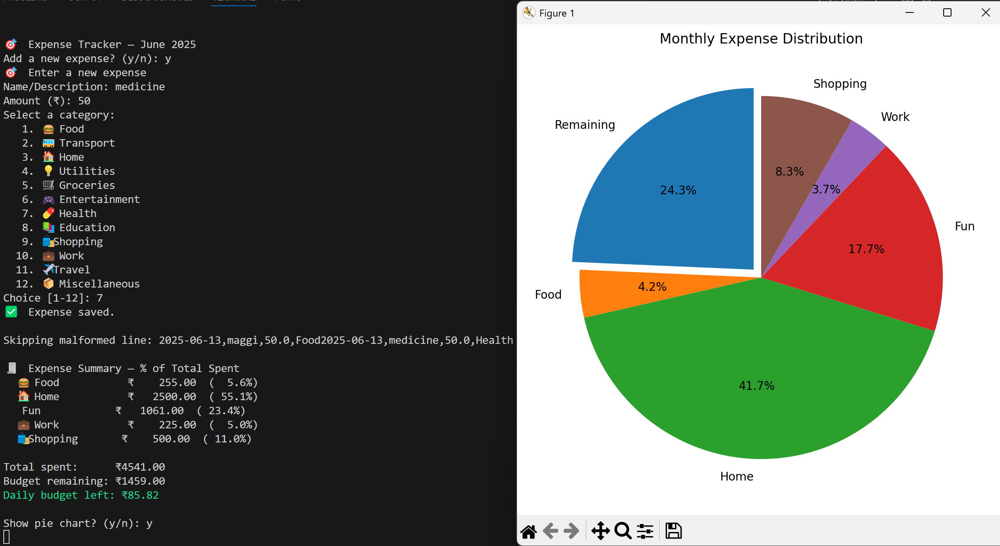

# 🧾 Expense Tracker (CLI)


## 📌 Project Overview

This **Expense Tracker** is a command‑line application built in Python as part of the **RISE (Real‑time Internship & Skill Enhancement)** program by **Tamizhan Skills**.\
It helps users record daily expenses, categorise them, and visualise spending trends over a month — all without needing an internet connection or a heavy database.

---

## 🏁 About RISE

**RISE** is a free, project‑based internship initiative that bridges theoretical concepts with practical, real‑world projects across domains:

- 💻 Web Development
- 📊 Data Science
- 🤖 Artificial Intelligence
- 🌐 IoT
- 🐍 Python Programming (my chosen domain)
- 📱 Mobile App Development
- 🛠️ etc.

---

## 🔧 Project 2: Expense Tracker (CLI)

### 📝 Problem Statement

Managing daily or monthly expenses is often tedious for students and families. A lightweight, offline tool can simplify the process and improve financial awareness.

### 🎯 Objective

Build a **Command‑Line Expense Tracker** that allows users to:

1. **Add expenses** by category and date.
2. **Store data** in a local file (CSV or JSON).
3. **Show monthly totals** per category.
5. **Generate summaries** and **pie‑chart visualisations** of spending vs. remaining budget.

---

## 🚀 Features

- ✅ **Month‑aware budgeting** with option to reuse last month’s budget.
- ✅ **Category selection** with emoji icons for a quick, friendly CLI.
- ✅ Automatic **CSV logging** of each month’s expenses and TXT storage of budgets.
- ✅ **Spending‑based summary** showing per‑category percentages.
- ✅ Optional **matplotlib pie chart** of spending vs. remaining funds.
- ✅ Colour‑coded daily budget reminder.

---

## 🖥️ Screenshot



---

## 📂 Technologies Used

| Component          | Description                           |
| ------------------ | ------------------------------------- |
| **Python 3.9+**    | Core language (standard library only) |
| **matplotlib**     | Data visualisation (pie chart)        |
| **CSV / File I/O** | Local data persistence                |

---

## 🧑‍💻 How to Run

1. **Clone / Download** this repository.
2. **Install dependencies** (only `matplotlib`):
   ```bash
   pip install matplotlib
   ```
3. **Run the tracker**:
   ```bash
   python expense_tracker.py
   ```
4. Follow the prompts to:
   - Enter or reuse the monthly budget.
   - Add new expenses.
   - View the summary and optional pie chart.

> **Note:** A new CSV file (e.g., `expenses_2025-06.csv`) is created for each month, alongside a `budget_YYYY-MM.txt` file that stores the month’s budget.

---

## 📊 Expected Outcome

A lightweight, offline CLI tool that:

- Logs expenses neatly into month‑specific CSV files.
- Provides instant spending summaries and a clear view of budget health.
- Offers a simple pie‑chart visualisation to reinforce financial insights.

---

## 📢 Credits

This project is part of the **RISE Internship** initiative by [Tamizhan Skills](https://www.tamizhanskills.com).\
Created by: **Akarsh Kumar**\
Domain: **Python Programming**

---

## 🗒️ File Structure (after first run)

```
project_root/
├─ expense_tracker.py
├─ README.md
├─ expenses_2025-06.csv        # auto‑generated
├─ budget_2025-06.txt          # auto‑generated
└─ Screenshot.png              # optional image
```

